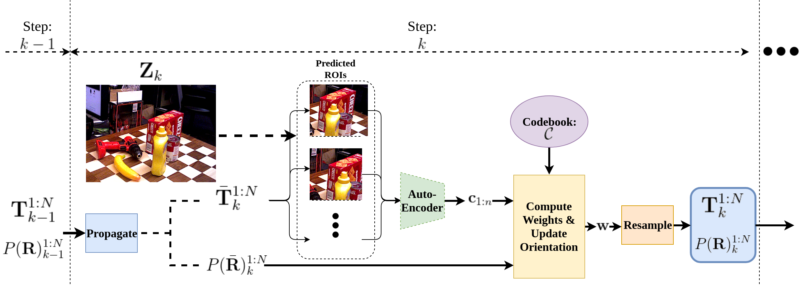
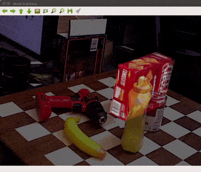

# PoseRBPF: A Rao-Blackwellized Particle Filter for 6D Object Pose Tracking

* [PoseRBPF Paper](https://arxiv.org/abs/1905.09304)
* [Self-supervision Paper](https://arxiv.org/abs/1909.10159)
* [Pose Estimation Video](https://youtu.be/lE5gjzRKWuA)
* [Robot Manipulation Video](https://youtu.be/W1Y0Mmh1Gd8)

## Citing PoseRBPF
If you find the PoseRBPF code useful, please consider citing:

```bibtex
@inproceedings{deng2019pose,
author    = {Xinke Deng and Arsalan Mousavian and Yu Xiang and Fei Xia and Timothy Bretl and Dieter Fox},
title     = {PoseRBPF: A Rao-Blackwellized Particle Filter for 6D Object Pose Tracking},
booktitle = {Robotics: Science and Systems (RSS)},
year      = {2019}
}
@inproceedings{deng2020self,
author    = {Xinke Deng and Yu Xiang and Arsalan Mousavian and Clemens Eppner and Timothy Bretl and Dieter Fox},
title     = {Self-supervised 6D Object Pose Estimation for Robot Manipulation},
booktitle = {International Conference on Robotics and Automation (ICRA)},
year      = {2020}
}
```

## Installation 
```bash
git clone https://github.com/XinkeAE/PoseRBPF.git --recursive
```

Install dependencies:
- install anaconda according to [the official website](https://docs.anaconda.com/anaconda/install/).
- create the virtual env with ```pose_rbpf_env.yml```:
```angular2html
conda env create -f pose_rbpf_env.yml
conda activate pose_rbpf_env
``` 
- compile the YCB Renderer according to the [instruction](./ycb_render/README.md).
- compile the utility functions with:
```angular2html
sh build.sh
```

## Download
- [CAD Model for YCB Objects](https://drive.google.com/file/d/1KTV3g9q4R6b8jtgCHnpMcQJBDU5ccetr/view?usp=sharing): 743MB
- [CAD Model for T-LESS Objects](https://drive.google.com/file/d/15rCCI_hgsjei3zlvbF05HUzoYm2uP2fE/view?usp=sharing): 502MB
- [PoseCNN weights for 20 YCB Objects](https://drive.google.com/file/d/17KX_mOypOslI9zoh1wRGSKdCuIPJ8yNt/view?usp=sharing): 76MB
- [RGB Auto-encoder weights (YCB)](https://drive.google.com/file/d/1LGH1N1F8BRDkym75Du02R6qvDat7_40T/view?usp=sharing): 6GB
- [RGB-D Auto-encoder weights (YCB)](https://drive.google.com/file/d/1dwR4dWgp-1jjS0aFwMZt5p65OLl9UdaN/view?usp=sharing): 9GB
- [Self-supervided trained RGB Auto-encoder weights (YCB)](https://drive.google.com/file/d/1mHHbIzDO3kbIa9_4-Z5GU-dGoV-rMyJL/view?usp=sharing): 5GB
- [RGB Auto-encoder weights (T-LESS)](https://drive.google.com/file/d/1NYhBfeuT3D73kG3SBN62-Bpfotmcf8Qg/view?usp=sharing): 8GB
- [RGB-D Auto-encoder weights (T-LESS)](https://drive.google.com/file/d/1-JWBfSy75exvXIKyRyzePKKOGHCVJWLi/view?usp=sharing): 12GB

Downolad files as needed. Extract CAD models under the ```cad_models``` directory, and extract model weights under the ```checkpoints``` directory.

## A quick demo on the YCB Video Dataset 

- The demo shows tracking ```003_cracker_box``` on YCB Video Dataset.
- Run script ```download_demo.sh``` to download checkpoint (434 MB), CAD models (743 MB), 2D detections (13 MB), and necessary data (3 GB) for the demo:
```angular2html
./scripts/download_demo.sh
```
- Then you should have files organized like:
```angular2html
├── ...
├── PoseRBPF
|   |── cad_models
|   |   |── ycb_models
|   |   └── ...
|   |── checkpoints
|   |   |── ycb_ckpts_roi_rgbd
|   |   |── ycb_codebooks_roi_rgbd
|   |   |── ycb_configs_roi_rgbd
|   |   └── ... 
|   |── detections
|   |   |── posecnn_detections
|   |   |── tless_retina_detections 
|   |── config                      # configuration files for training and DPF
|   |── networks                    # auto-encoder networks
|   |── pose_rbpf                   # particle filters
|   └── ...
|── YCB_Video_Dataset               # to store ycb data
|   |── cameras
|   |── data 
|   |── image_sets 
|   |── keyframes 
|   |── poses
|   └── ...
└── ...
```

- Run demo with ```003_cracker_box```. The results will be stored in ```./results/```
```angular2html
./scripts/run_demo.sh
```

## Online Real-world Pose Estimation using ROS

- Due to the incompatibility between ROS Kinetic and Python 3, the ROS node only runs with Python 2.7. We first create the virtual env with ```pose_rbpf_env_py2.yml```:
```angular2html
conda env create -f pose_rbpf_env_py2.yml
conda activate pose_rbpf_env_py2
```
- compile the YCB Renderer according to the [instruction](./ycb_render/README.md).
- compile the utility functions with:
```angular2html
sh build.sh
```
- Make sure you can run the demo above first.
- Install ROS if it's not there:
```angular2html
sudo sh -c 'echo "deb http://packages.ros.org/ros/ubuntu $(lsb_release -sc) main" > /etc/apt/sources.list.d/ros-latest.list'
sudo apt-key adv --keyserver 'hkp://keyserver.ubuntu.com:80' --recv-key C1CF6E31E6BADE8868B172B4F42ED6FBAB17C654
sudo apt-get update
sudo apt-get install ros-kinetic-desktop-full
```

- Update python packages:
```angular2html
conda install -c auto catkin_pkg
pip install -U rosdep rosinstall_generator wstool rosinstall six vcstools
pip install msgpack
pip install empy
```

- Source ROS (every time before launching the node):
```angular2html
source /opt/ros/kinetic/setup.bash
```

- Initialze rosdep:
```angular2html
sudo rosdep init
rosdep update
```

### Single object tracking demo:
- Download demo rosbag:
```angular2html
./scripts/download_ros_demo.sh
```

- Run PoseCNN node (with roscore running in another terminal, download PoseCNN weights first):
```angular2html
./scripts/run_ros_demo_posecnn.sh
```

- Run PoseRBPF node for RGB-D tracking (with roscore running in another terminal):
```angular2html
./scripts/run_ros_demo.sh
```

- (Optional) For RGB tracking run this command instead:
```angular2html
./scripts/run_ros_demo_rgb.sh
```

- Run RVIZ in the PoseRBPF directory:
```angular2html
rosrun rviz rviz -d ./ros/tracking.rviz
```

- Once you see ```*** PoseRBPF Ready ...``` in the PoseRBPF terminal, run rosbag in another terminal, then you should be able to see the tracking demo:
```angular2html
rosbag play ./ros_data/demo_single.bag
```

### Multiple object tracking demo:
- Download demo rosbag:
```angular2html
./scripts/download_ros_demo_multiple.sh
```

- Run PoseCNN node (with roscore running in another terminal, download PoseCNN weights first):
```angular2html
./scripts/run_ros_demo_posecnn.sh
```

- Run PoseRBPF node with self-supervised trained RGB Auto-encoder weights:
```angular2html
./scripts/run_ros_demo_rgb_multiple_ssv.sh
```

- (Optional) Run PoseRBPF node with RGB-D Auto-encoder weights instead:
```angular2html
./scripts/run_ros_demo_multiple.sh
```

- (Optional) Run PoseRBPF node with RGB Auto-encoder weights instead:
```angular2html
./scripts/run_ros_demo_rgb_multiple.sh
```

- Run RVIZ in the PoseRBPF directory:
```angular2html
rosrun rviz rviz -d ./ros/tracking.rviz
```

- Once you see ```*** PoseRBPF Ready ...``` in the PoseRBPF terminal, run rosbag in another terminal, then you should be able to see the tracking demo:
```angular2html
rosbag play ./ros_data/demo_multiple.bag
```
Note that PoseRBPF takes certain time to initialize each object before tracking. You can pause the ROS bag by pressing space for initialization, and then press space again to resume tracking.

## Testing on the YCB Video Dataset
- Download checkpoints from [the google drive folder](https://drive.google.com/drive/folders/1mkW9RSgXHKnYmSJIKEI3pjaNgc_IKpgD?usp=sharing) (```ycb_rgbd_full.tar.gz``` or ```ycb_rgb_full.tar.gz```) and unzip to the checkpoint directory.
- Download all the data in the [YCB Video Dataset](https://rse-lab.cs.washington.edu/projects/posecnn/) so the ```../YCB_Video_Dataset/data``` folder contains all the sequences.
- Run RGB-D tracking (use ```002_master_chef_can``` as an example here):
```angular2html
sh scripts/test_ycb_rgbd/val_ycb_002_rgbd.sh 0 1
```
- Run RGB tracking (use ```002_master_chef_can``` as an example here):
```angular2html
sh scripts/test_ycb_rgb/val_ycb_002_rgb.sh 0 1
```

## Testing on the T-LESS Dataset
- Download checkpoints from [the google drive folder](https://drive.google.com/drive/folders/1mkW9RSgXHKnYmSJIKEI3pjaNgc_IKpgD?usp=sharing) (```tless_rgbd_full.tar.gz``` or ```tless_rgb_full.tar.gz```) and unzip to the checkpoint directory.
- Download all the data in the [T-LESS Dataset](http://cmp.felk.cvut.cz/t-less/download.html) so the ```../TLess/``` folder contains all the sequences.
- Download all the models for T-LESS objects from [the google drive folder](https://drive.google.com/file/d/15rCCI_hgsjei3zlvbF05HUzoYm2uP2fE/view?usp=sharing).
- Then you should have files organized like:
```angular2html
├── ...
├── PoseRBPF
|   |── cad_models
|   |   |── ycb_models
|   |   |── tless_models
|   |   └── ...
|   |── checkpoints
|   |   |── tless_ckpts_roi_rgbd
|   |   |── tless_codebooks_roi_rgbd
|   |   |── tless_configs_roi_rgbd
|   |   └── ... 
|   |── detections
|   |   |── posecnn_detections
|   |   |── tless_retina_detections 
|   |── config                      # configuration files for training and DPF
|   |── networks                    # auto-encoder networks
|   |── pose_rbpf                   # particle filters
|   └── ...
|── YCB_Video_Dataset               # to store ycb data
|   |── cameras  
|   |── data 
|   |── image_sets 
|   |── keyframes 
|   |── poses               
|   └── ...   
|── TLess               # to store tless data
|   |── t-less_v2 
|── tless_ckpts_roi_rgbd
|   |   |── test_primesense
|   |   └── ... 
|   └── ...        
└── ...
```
- Run RGB-D tracking (use ```obj_01``` as an example here):
```angular2html
sh scripts/test_tless_rgbd/val_tless_01_rgbd.sh 0 1
```
- Run RGB tracking (use ```obj_01``` as an example here):
```angular2html
sh scripts/test_tless_rgb/val_tless_01_rgb.sh 0 1
```

## Training
- Download microsoft coco dataset 2017 val images from [here](http://images.cocodataset.org/zips/val2017.zip) for data augmentation.
- Store the folder ```val2017``` in ```../coco/```
- Run training example for ```002_master_chef_can``` in the YCB objects. The training should be able to run on one single NVIDIA TITAN Xp GPU:
```angular2html
sh scripts/train_ycb_rgbd/train_script_ycb_002.sh
```

## Acknowledgements
We have referred to part of the RoI align code from [maskrcnn-benchmark](https://github.com/facebookresearch/maskrcnn-benchmark).

## License
PoseRBPF is licensed under the [NVIDIA Source Code License - Non-commercial](LICENSE.md).
